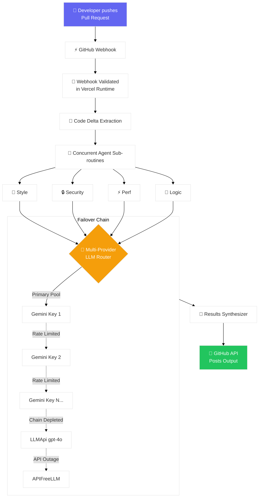
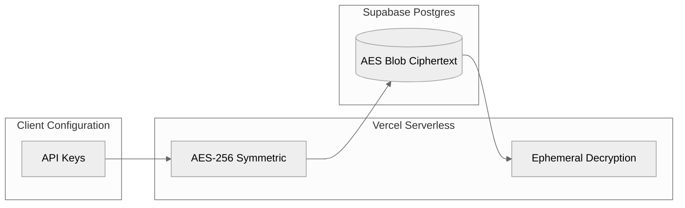

<p align="center">
  
</p>

<h1 align="center">PRPilot — Enterprise AI Code Reviewer</h1>

<p align="center">
  <strong>Automated, zero-downtime AI code reviews delivered instantly to your GitHub Pull Requests.</strong>
</p>

<p align="center">
  <a href="#-what-is-prpilot">About</a> •
  <a href="#-features">Features</a> •
  <a href="#-quick-start">Quick Start</a> •
  <a href="#-installation">Installation</a> •
  <a href="#️-architecture">Architecture</a> •
  <a href="#-deployment">Deployment</a> •
  <a href="docs/TESTING_GUIDE.md">🧪 Testing Guide</a>
</p>

<p align="center">
  
  
  
  
  
</p>

---

## 🎯 What is PRPilot?

**PRPilot** is an industry-grade GitHub App that brings a highly available, AI-powered team of security researchers, logic validators, and performance architects directly into your CI/CD pipeline. 

The moment you open a Pull Request, PRPilot analyzes the code diff concurrently across **4 specialized analysis agents**. It uses an advanced **Multi-LLM Routing architecture** to ensure reviews never fail due to rate limits or API outages. Combining Google Gemini 2.0 Flash with automated fallbacks to OpenAI's GPT-4o architecture via LLMApi and APIFreeLLM, this tool provides relentless code coverage.

---

## 📸 In Action

<p align="center">
  
  <br><em>Install PRPilot directly from GitHub to ignite automated reviews</em>
</p>

---

## ✨ Enterprise-Grade Features

### 🤖 Specialized AI Agents
PRPilot avoids generic LLM responses by breaking reviews down into strict concurrent domains:

| Agent | Responsibilities |
|-------|-------------|
| 🎨 **Style & Syntax** | Lint checks, naming conventions, language best practices, formatting |
| 🔒 **Security Scanning** | SQL injection, hardcoded credentials, XSS vectors, authentication flaws |
| ⚡ **Performance Arch** | Big O optimization, memory leak detection, N+1 query warnings |
| 🧠 **Logic & Bounds** | Edge cases, unhandled nulls, missing try-catches, logic regressions |

### 🔄 Multi-LLM High-Availability Architecture
Never suffer from a `429 Rate Limit` failure again. PRPilot utilizes an intelligent fallback chain:
1. **Multi-Key Gemini Rotation**: Iterates sequentially through an array of Gemini 2.0 Flash API keys to maximize standard throughput.
2. **GPT-4o via LLMApi**: If Gemini quotas are exhausted, operations seamlessly fall back to LLMApi.ai running `gpt-4o`.
3. **APIFreeLLM Routing**: The tertiary safety net ensures 100% review uptime during sudden traffic spikes.

### 🌟 Additional Highlights
- 🚀 **Zero-Config Install** — Install directly from GitHub; it works out of the box.
- 🔐 **Military-Grade Security** — API keys are encrypted at rest with AES-256 and only decrypted momentarily during ephemeral runtime.
- 🌐 **Polyglot Parsing** — Native support for Python, JS/TS, Go, Rust, Java, C++, and more.
- ⚡ **Serverless Delivery** — Delivered via Vercel Edge scaling. Reviews post within 10–30 seconds.

---

## 🚀 Quick Start (Local Testing)

Run the Multi-Agent review lifecycle entirely on your local machine before connecting GitHub:

```bash
# 1. Clone the repository
git clone https://github.com/mirzasayzz/prpilot.git
cd prpilot

# 2. Virtual Environment Setup
python -m venv venv
source venv/bin/activate
pip install -r requirements.txt

# 3. Secure your secrets locally (.env)
export GEMINI_API_KEYS="key1,key2,key3"    # Supports multiple keys
export LLMAPI_API_KEY="your-llmapi-key"   # Auto-fallback to GPT-4o
export APIFREE_API_KEY="your-apifree-key" # Auto-fallback 

# 4. Trigger localized analysis
python test_local.py test_samples/sample_code.py
```

<details>
<summary><b>Click to see expected output</b></summary>

```
🤖 PRPilot - Local Test (Multi-Provider Active)
Agents: style, security, performance, logic

📁 Reviewing: test_samples/sample_code.py
📏 Lines: 103

🎨 Style Agent analyzing...    ✅ No issues found
🔒 Security Agent analyzing... 🔴 Critical: 2 issues found
⚡ Performance Agent analyzing... 🟡 Warning: 1 issue found
🧠 Logic Agent analyzing...    ✅ No issues found

📊 SUMMARY: 3 issues identified. 
```
</details>

---

## 📦 Installation & GitHub Delivery

### Method A: Single-Click App Installation
1. Navigate to: **[github.com/apps/prpilot-mirzasayzz](https://github.com/apps/prpilot-mirzasayzz)**
2. Click **Install**.
3. Choose to install on `All Repositories` or specific targets.
4. **Done.** Pushing to a Pull Request will automatically trigger the webhook.

> 📖 See the **[Testing Guide](docs/TESTING_GUIDE.md)** for detailed CI/CD verification workflows.

---

## 🏗️ Architecture Design

### Routing & High Availability Fallbacks



### Encryption & Data Persistence



---

## 🚀 Infrastructure Deployment (Hosting it yourself)

Deploying the architecture to your own infrastructure requires Vercel and Supabase.

### 1. Database (Supabase)
1. Initialize a Supabase project.
2. In the **SQL Editor**, execute [`db/schema.sql`](db/schema.sql).
3. Extract your **Project URL** and **service_role** key.

### 2. GitHub App Authority
1. Visit **Developer Settings → GitHub Apps → New GitHub App**.
2. **Webhook URL**: `https://your-domain.vercel.app/api/webhook`
3. **Permissions**: `Pull Requests` (Read & Write), `Contents` (Read).
4. **Events**: `Pull request`.
5. Retain your **App ID** and **`.pem` Private Key**.

### 3. Vercel CI/CD
```bash
# Vercel Configuration
vercel login && vercel link

# Map robust multi-provider configuration
vercel env add GITHUB_APP_ID production
vercel env add GITHUB_PRIVATE_KEY production
vercel env add GITHUB_WEBHOOK_SECRET production
vercel env add SUPABASE_URL production
vercel env add SUPABASE_SERVICE_KEY production

# High-Availability LLM Configuration
vercel env add GEMINI_API_KEYS production # Comma-separated
vercel env add LLMAPI_API_KEY production  # First fallback
vercel env add APIFREE_API_KEY production # Second fallback

# Symmetric Encryption Key
python3 -c "import base64,os; print(base64.urlsafe_b64encode(os.urandom(32)).decode())" | vercel env add ENCRYPTION_KEY production

# Push to edge network
vercel --prod
```

---

## 📁 Repository Map

```
prpilot/
├── api/                        # Serverless entry points
│   ├── webhook.py              # Webhook ingest & signature validation
│   └── config.py               # Application configuration 
├── agents/                     # Code intelligence framework
│   ├── base.py                 # Core agent schema & prompt interfaces
│   ├── style_agent.py          # Syntax specific evaluation
│   ├── security_agent.py       # Vulnerability metrics
│   ├── performance_agent.py    # Algorithmic time-complexity tracking
│   ├── logic_agent.py          # State/Bounds logic checking
│   └── llm_client.py           # Multi-Provider automated failover architecture
├── db/                         # PostgreSQL schema definitions
├── public/                     # Static UI & landing sites
├── docs/                       # Validation & QA procedures
│   └── TESTING_GUIDE.md        
└── test_local.py               # CLI test harness
```

---

## 🤝 Contributing

We rely on the open-source community to build better heuristics.
1. **Fork** the repository
2. **Branch**: `git checkout -b feature/enhanced-routing`
3. **Validate**: Run `test_local.py` ensuring all providers respond.
4. **Push & Pull Request** — PRPilot will automatically review your code.

---

## 📄 License & Compliance

This software is released under the **MIT License**. Operations comply strictly with SOC-ready architectural standards—keys are universally encrypted. See [LICENSE](LICENSE) for granular clauses.

---

<p align="center">
  Architected by <a href="https://github.com/mirzasayzz">mirzasayzz</a>
</p>
