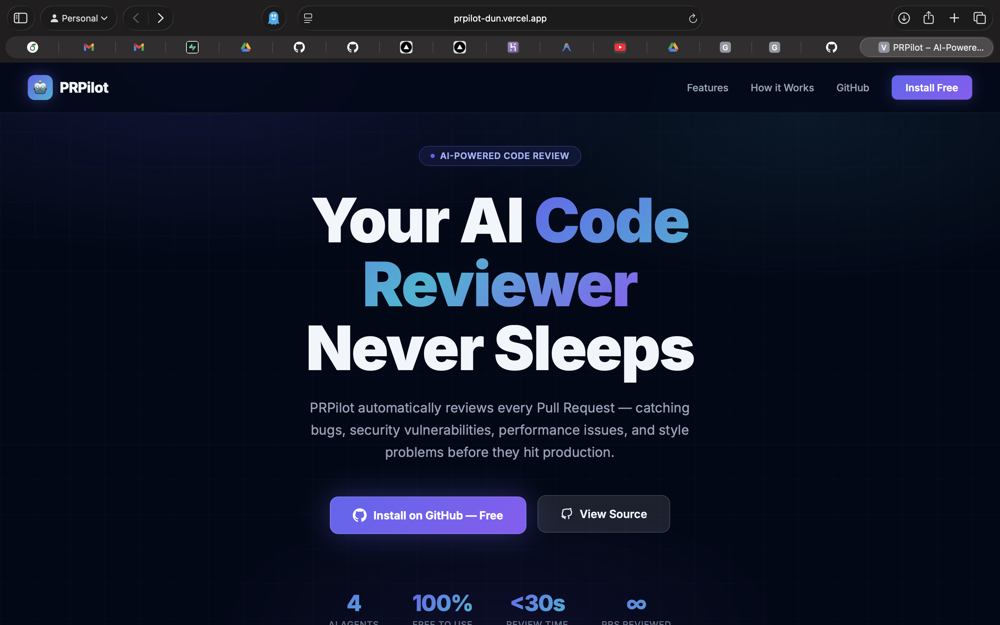
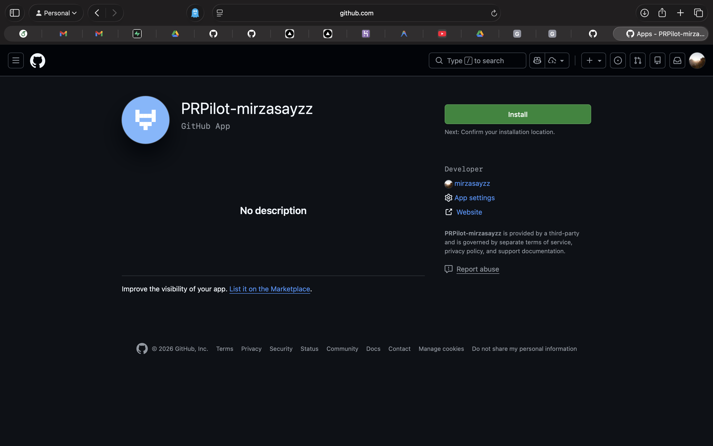
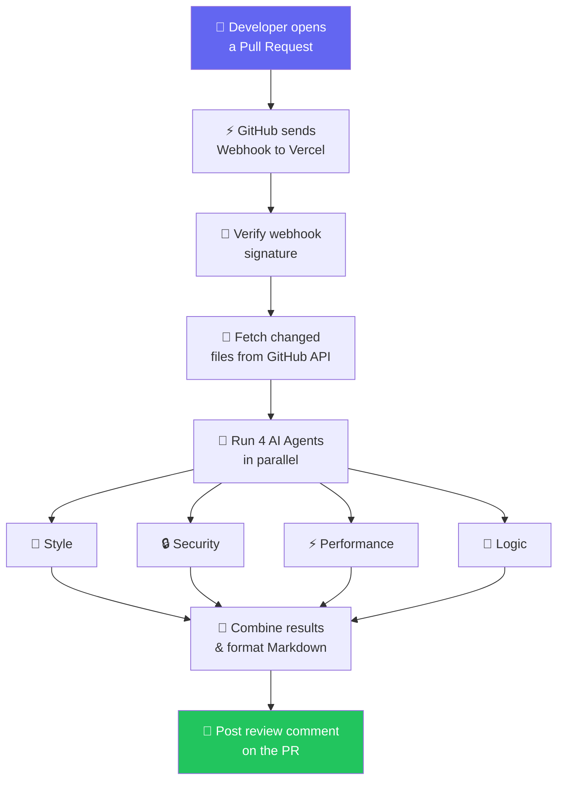
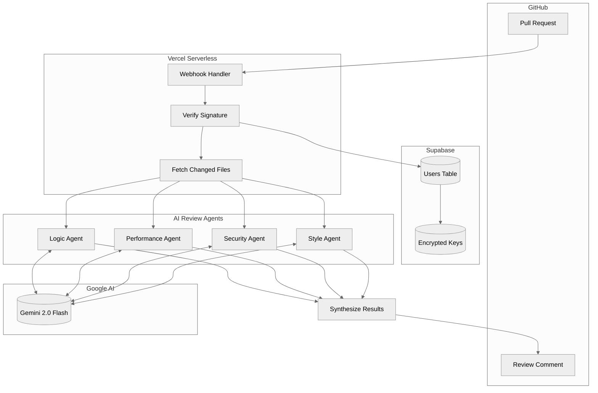
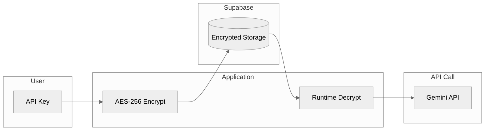

<p align="center">
  
</p>

<h1 align="center">PRPilot</h1>

<p align="center">
  <strong>AI-powered automated code reviews on every GitHub Pull Request</strong>
</p>

<p align="center">
  <a href="#-what-is-prpilot">About</a> •
  <a href="#-features">Features</a> •
  <a href="#-quick-start">Quick Start</a> •
  <a href="#-installation">Installation</a> •
  <a href="#️-architecture">Architecture</a> •
  <a href="#-deployment">Deployment</a> •
  <a href="docs/TESTING_GUIDE.md">🧪 Testing Guide</a>
</p>

<p align="center">
  
  
  
  
  
</p>

---

## 🎯 What is PRPilot?

**PRPilot** is a GitHub App that automatically reviews every Pull Request using **4 specialized AI agents** running in parallel. The moment you open a PR, PRPilot analyzes your code and posts a detailed review comment — catching bugs, security holes, performance issues, and style problems before they hit production.

> 💡 **Powered by Google Gemini 2.0 Flash** — fast, free, and highly accurate code analysis with no subscription required.

---

## 📸 Screenshots

<p align="center">
  
  <br><em>PRPilot Landing Page — <a href="https://prpilot-dun.vercel.app">prpilot-dun.vercel.app</a></em>
</p>

<p align="center">
  
  <br><em>Install PRPilot directly from GitHub to start getting automated reviews</em>
</p>

---

## ✨ Features

### 🤖 4 Specialized AI Agents

| Agent | What It Does |
|-------|-------------|
| 🎨 **Style Agent** | Naming conventions, formatting, code organization, language best practices |
| 🔒 **Security Agent** | SQL injection, hardcoded secrets, XSS vectors, authentication flaws |
| ⚡ **Performance Agent** | O(n²) complexity, memory leaks, N+1 queries, optimization opportunities |
| 🧠 **Logic Agent** | Bugs, edge cases, null pointer errors, missing error handling |

### 🌟 Additional Highlights

- 🚀 **One-click Install** — Install directly from GitHub, no config files needed
- 🆓 **Free to Use** — Runs on Gemini 2.0 Flash free tier (15 RPM)
- 🔐 **Secure** — API keys encrypted with AES-256 before storage, never stored in plain text
- 🌐 **Multi-language** — Python, JavaScript, TypeScript, Go, Rust, Java, C++, and more
- ⚙️ **Configurable** — Enable or disable individual agents per repository
- ⚡ **Fast** — Reviews post within 10–30 seconds of opening a PR

---

## 🚀 Quick Start

### Option A — Test Locally (No GitHub App Required)

Run the AI agents on any file on your machine in under 5 minutes:

```bash
# 1. Clone the repo
git clone https://github.com/mirzasayzz/prpilot.git
cd prpilot

# 2. Set up Python environment
python -m venv venv
source venv/bin/activate   # Windows: venv\Scripts\activate
pip install -r requirements.txt

# 3. Add your free Gemini API key (get one at https://aistudio.google.com/apikey)
export GEMINI_API_KEY="your-api-key-here"

# 4. Run a review on the included sample file
python test_local.py test_samples/sample_code.py
```

**Expected output:**

```
🤖 PRPilot - Local Test
Agents: style, security, performance, logic

📁 Reviewing: test_samples/sample_code.py
📏 Lines: 103

🎨 Style Agent analyzing...    ✅ No issues found
🔒 Security Agent analyzing... ⚠️  2 issues found
⚡ Performance Agent analyzing... ⚠️  1 issue found
🧠 Logic Agent analyzing...    ✅ No issues found

📊 SUMMARY: 3 issues found
```

### Option B — Use the Live GitHub App

1. Go to 👉 **[github.com/apps/prpilot-mirzasayzz](https://github.com/apps/prpilot-mirzasayzz)**
2. Click **Install** → select your repositories
3. Open any Pull Request on those repos
4. PRPilot will automatically post a review within seconds ✅

---

## 📦 Installation

### Installing the GitHub App

```
1. Visit:  https://github.com/apps/prpilot-mirzasayzz
2. Click:  "Install"
3. Select: Your account (mirzasayzz) and which repos to enable
4. Done!   Open a PR to see PRPilot in action
```

> 📖 For a complete step-by-step walkthrough including how to verify everything is working, see the **[Testing Guide](docs/TESTING_GUIDE.md)**.

### Self-Hosted Deployment

See the [Deployment](#-deployment) section below to host your own instance.

---

## 🏗️ Architecture

### How It Works



### System Architecture (Detailed)



### Data Flow Table

| Step | Component | Description |
|:----:|-----------|-------------|
| 1️⃣ | **GitHub** | PR opened/updated → webhook fired |
| 2️⃣ | **Vercel** | Receives POST at `/api/webhook`, verifies signature |
| 3️⃣ | **Supabase** | Looks up installation config and encrypted API key |
| 4️⃣ | **GitHub API** | Fetches the code diff and changed files |
| 5️⃣ | **4 AI Agents** | Run concurrently — each specializes in one domain |
| 6️⃣ | **Gemini 2.0** | Processes each agent's prompt and returns JSON issues |
| 7️⃣ | **Synthesizer** | Merges results, removes duplicates, formats as Markdown |
| 8️⃣ | **GitHub API** | Posts the final review comment on the PR |

### Security Architecture



> **Your API key never touches our servers in plain text.** It is encrypted before storage and only decrypted in memory during the review process.


---

## ⚙️ Configuration

After installing, these settings can be toggled per-installation:

| Setting | Description | Default |
|---------|-------------|---------|
| `GEMINI_API_KEY` | Your Google Gemini API key | Required |
| Style Agent | Code style and formatting checks | ✅ On |
| Security Agent | Security vulnerability scanning | ✅ On |
| Performance Agent | Performance bottleneck detection | ✅ On |
| Logic Agent | Bug and logic error detection | ✅ On |

---

## 🚀 Deployment

> Want to self-host PRPilot on your own Vercel + Supabase? Follow these steps.

### Prerequisites

- [Supabase](https://supabase.com) account (free tier works)
- [Vercel](https://vercel.com) account (free tier works)
- [Google AI Studio](https://aistudio.google.com) API key (free)
- GitHub account to create a GitHub App

### Step 1 — Database Setup (Supabase)

1. Create a new Supabase project
2. Go to **SQL Editor** → New query
3. Paste and run the contents of [`db/schema.sql`](db/schema.sql)
4. Copy your **Project URL** and **service_role** secret key

### Step 2 — Create a GitHub App

1. Go to **GitHub Settings → Developer Settings → GitHub Apps → New GitHub App**
2. Fill in:
   - **Name**: anything unique (e.g. `yourname-prpilot`)
   - **Webhook URL**: `https://your-app.vercel.app/api/webhook`
   - **Webhook Secret**: any strong password
   - **Permissions**: Pull Requests (Read & Write), Contents (Read-only)
   - **Events**: Subscribe to `Pull request`
3. Click **Create GitHub App**
4. Note the **App ID** and generate + download a **Private Key** (`.pem` file)

### Step 3 — Deploy to Vercel

```bash
# Install Vercel CLI
npm install -g vercel

# Login and link project
vercel login
vercel link

# Add environment variables
echo -n "your-app-id"          | vercel env add GITHUB_APP_ID production
cat your-key.pem               | vercel env add GITHUB_PRIVATE_KEY production
echo -n "your-webhook-secret"  | vercel env add GITHUB_WEBHOOK_SECRET production
echo -n "https://xxx.supabase.co" | vercel env add SUPABASE_URL production
echo -n "your-service-key"     | vercel env add SUPABASE_SERVICE_KEY production
echo -n "your-gemini-key"      | vercel env add GEMINI_API_KEY production
python3 -c "import base64,os; print(base64.urlsafe_b64encode(os.urandom(32)).decode())" \
                               | vercel env add ENCRYPTION_KEY production

# Deploy to production
vercel --prod
```

### Step 4 — Update GitHub App Webhook URL

1. Go to your GitHub App settings
2. Update the **Webhook URL** to your actual Vercel deployment URL
3. Save changes

### Environment Variables Reference

| Variable | Description |
|----------|-------------|
| `GITHUB_APP_ID` | Your GitHub App's numeric ID |
| `GITHUB_PRIVATE_KEY` | Full PEM private key content |
| `GITHUB_WEBHOOK_SECRET` | Secret string for webhook signature verification |
| `SUPABASE_URL` | Your Supabase project URL |
| `SUPABASE_SERVICE_KEY` | Supabase service role key (keep secret!) |
| `GEMINI_API_KEY` | Google Gemini API key |
| `ENCRYPTION_KEY` | Base64-encoded 32-byte key for encrypting user API keys |

---

## 📁 Project Structure

```
prpilot/
├── api/                        # Vercel serverless functions
│   ├── webhook.py              # Main GitHub webhook handler
│   ├── config.py               # User configuration endpoint
│   └── index.py                # Health check endpoint
├── agents/                     # AI review agents
│   ├── base.py                 # Base agent class (shared logic)
│   ├── style_agent.py          # Code style analysis
│   ├── security_agent.py       # Security vulnerability detection
│   ├── performance_agent.py    # Performance issue detection
│   ├── logic_agent.py          # Bug and logic detection
│   └── llm_client.py           # Multi-provider LLM client (Gemini + Groq fallback)
├── db/
│   └── schema.sql              # Supabase database schema
├── public/
│   ├── index.html              # Landing page
│   └── config.html             # User configuration UI
├── docs/
│   ├── TESTING_GUIDE.md        # 📖 A-Z guide to test PRPilot
│   └── screenshots/            # README screenshots
├── test_samples/
│   └── sample_code.py          # Sample file with intentional issues
├── test_local.py               # Local CLI testing tool
├── requirements.txt
└── vercel.json                 # Vercel routing config
```

---

## 🧪 Testing

For a complete guide on how to verify PRPilot is working end-to-end — including how to create a test PR, check webhook logs, and confirm Supabase is recording data — see:

### 📖 [docs/TESTING_GUIDE.md](docs/TESTING_GUIDE.md)

**Quick checklist:**
- [ ] `curl https://prpilot-dun.vercel.app/api/webhook` returns `{"status": "healthy"}`
- [ ] GitHub App installed on your test repo
- [ ] Open a PR on a non-main branch in that repo
- [ ] PRPilot posts a review comment within 30 seconds
- [ ] Webhook shows **200 ✅** in GitHub App → Advanced → Recent Deliveries

---

## 🤝 Contributing

Contributions are welcome!

1. **Fork** the repository
2. **Create** a feature branch: `git checkout -b feature/my-feature`
3. **Commit** your changes: `git commit -m 'feat: add my feature'`
4. **Push**: `git push origin feature/my-feature`
5. **Open** a Pull Request (PRPilot will review it automatically! 😄)

**Good first issues:**
- Improve agent prompts for better detection accuracy
- Add support for more programming languages
- Write more test samples in `test_samples/`
- Improve error handling and retry logic

---

## 🔗 Links

| Resource | URL |
|----------|-----|
| 🌐 Live App | https://prpilot-dun.vercel.app |
| 📦 GitHub App | https://github.com/apps/prpilot-mirzasayzz |
| 🗄️ Privacy Policy | [PRIVACY.md](PRIVACY.md) |
| 📋 Terms of Service | [TERMS.md](TERMS.md) |
| 🔑 Get Free Gemini Key | https://aistudio.google.com/apikey |

---

## 📄 License

This project is licensed under the **MIT License** — see the [LICENSE](LICENSE) file for details.

---

<p align="center">
  Built with ❤️ by <a href="https://github.com/mirzasayzz">mirzasayzz</a>
</p>
