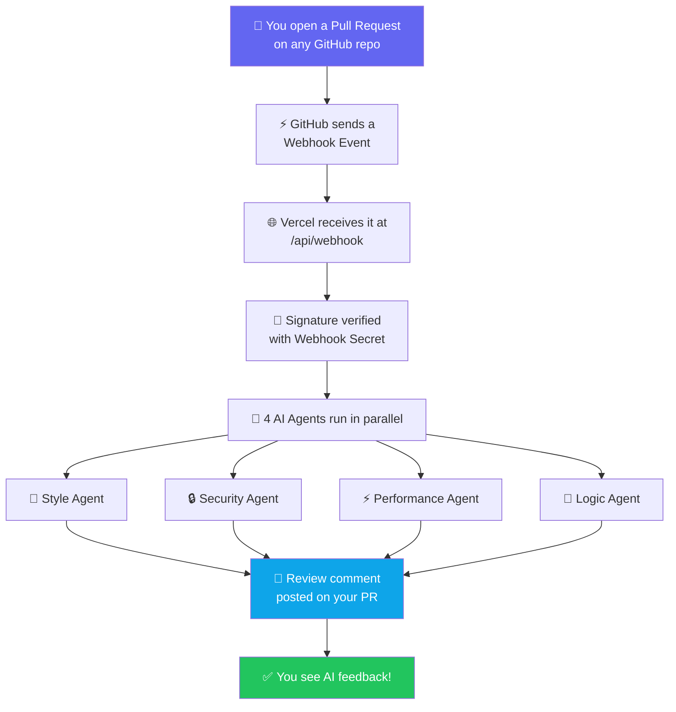
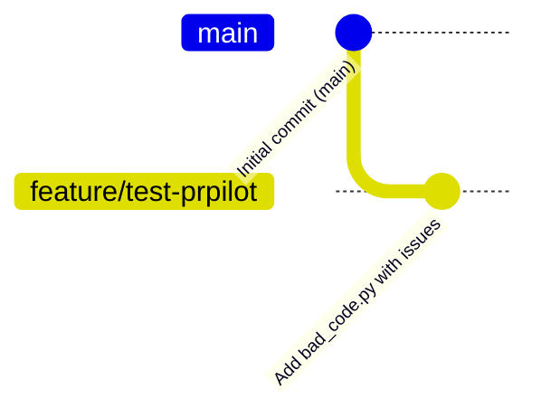

# 🧪 PRPilot — Complete Testing Guide (A to Z)

> **How to verify that PRPilot is fully working end-to-end**

---

## 📊 How It All Flows



---

## ✅ Pre-Check: Is Everything Set Up?

Before testing, verify the 5 requirements:

| Requirement | Where to Check |
|------------|---------------|
| ✅ PRPilot deployed on Vercel | `https://prpilot-dun.vercel.app/api/webhook` → should return `{"status": "healthy"}` |
| ✅ GitHub App created | `https://github.com/settings/apps/prpilot-mirzasayzz` |
| ✅ Webhook URL set correctly | Same page → Webhook URL = `https://prpilot-dun.vercel.app/api/webhook` |
| ✅ Supabase tables created | Supabase Dashboard → Table Editor → `installations` + `reviews` tables exist |
| ✅ All env vars set on Vercel | Vercel Dashboard → Project → Settings → Environment Variables |

---

## 🔢 Step-by-Step Testing Guide

---

### STEP 1 — Verify the Webhook Endpoint is Live

Open your browser or terminal and check:

```bash
curl https://prpilot-dun.vercel.app/api/webhook
```

**Expected response:**
```json
{"status": "healthy", "service": "PRPilot Webhook"}
```

✅ **If you see this** → Vercel deployment is working  
❌ **If you get an error** → Redeploy on Vercel dashboard

---

### STEP 2 — Install PRPilot on Your Test Repository

```
📌 IMPORTANT: You must install the GitHub App on a repo first.
   Without installation, GitHub won't send any webhook events.
```

**Steps:**

1. Go to 👉 **https://github.com/apps/prpilot-mirzasayzz**

2. Click **"Install"**

   ![Install button on GitHub App page]

3. Choose **which account** to install on → select `mirzasayzz`

4. Choose **which repositories** — select either:
   - **"All repositories"** (easiest for testing), OR
   - **"Only select repositories"** → pick a specific test repo

5. Click **"Install & Authorize"**

6. ✅ You'll be redirected — this means installation was successful!

---

### STEP 3 — Create a Test Repository (if needed)

You need a **public or private GitHub repo** to test on. You can use your `prpilot` repo itself, or create a fresh one:

```bash
# Create a new test repo via GitHub CLI
gh repo create mirzasayzz/prpilot-test --public --description "Testing PRPilot"

# Clone it locally
git clone https://github.com/mirzasayzz/prpilot-test.git
cd prpilot-test
```

---

### STEP 4 — Create a Test File with Intentional Issues

Create a file with **known bugs** so PRPilot has something to catch:

```bash
# Create the test file
cat > bad_code.py << 'EOF'
import os

# SECURITY ISSUE: Hardcoded API key
API_KEY = "sk-1234567890abcdef"
DATABASE_PASSWORD = "admin123"

def get_users(user_input):
    # SECURITY ISSUE: SQL injection vulnerability
    query = "SELECT * FROM users WHERE name = '" + user_input + "'"
    return query

def slow_function(data):
    # PERFORMANCE ISSUE: O(n²) complexity
    result = []
    for i in data:
        for j in data:
            if i == j:
                result.append(i)
    return result

def divide(a, b):
    # LOGIC ISSUE: No zero division check
    return a / b

# STYLE ISSUE: bad naming convention
def getData():
    pass
EOF
```

---

### STEP 5 — Commit to a Branch (NOT main)



```bash
# Initialize git (if fresh repo)
git init
git add .
git commit -m "Initial commit"
git branch -M main
git push -u origin main

# Create a new branch for the PR
git checkout -b feature/test-prpilot

# Add the bad code file
git add bad_code.py
git commit -m "Add test code with intentional issues"
git push origin feature/test-prpilot
```

---

### STEP 6 — Open a Pull Request

1. Go to your repo on GitHub: `https://github.com/mirzasayzz/prpilot-test`

2. GitHub will show a banner: **"Compare & pull request"** → click it

   OR go to: **Pull requests tab → New pull request**

3. Set:
   - **Base branch**: `main`
   - **Compare branch**: `feature/test-prpilot`

4. Add a title: `"Test: checking PRPilot review"`

5. Click **"Create pull request"**

---

### STEP 7 — Watch PRPilot Review Your PR

```
⏱️ Within 10-30 seconds, PRPilot will post a comment on your PR
```

**What to look for:**

The PR will get a comment from the bot that looks like:

```
🤖 PRPilot

### 🔒 Security Issues
- [CRITICAL] Line 4: Hardcoded API key detected. Move to environment variables.
- [CRITICAL] Line 9: SQL injection vulnerability. Use parameterized queries.

### ⚡ Performance Issues  
- [HIGH] Line 14-19: O(n²) nested loop. Consider using a set for O(n) lookup.

### 🧠 Logic Issues
- [MEDIUM] Line 22: Division by zero not handled. Add a check for b == 0.

### 🎨 Style Issues
- [LOW] Line 26: Function 'getData' should follow snake_case convention.
```

---

### STEP 8 — Verify in Vercel Logs (if no comment appears)

If PRPilot **doesn't comment** within 60 seconds:

1. Go to **https://vercel.com/dashboard**
2. Click on your `prpilot` project
3. Click **"Functions"** tab → Look for `/api/webhook`
4. Check the **"Logs"** for any errors

**OR** check via CLI:
```bash
vercel logs prpilot --since 10m
```

---

### STEP 9 — Verify in GitHub Webhook Logs

1. Go to: **https://github.com/settings/apps/prpilot-mirzasayzz**
2. Click **"Advanced"** tab (in the left sidebar under the app settings)
3. Scroll down to **"Recent Deliveries"**
4. You should see recent webhook deliveries with status **200 ✅**

```
Recent Deliveries:
┌──────────────────────────────────────────────────┐
│ ✅ pull_request  200  2025-04-01 10:30 AM        │
│ ✅ pull_request  200  2025-04-01 10:28 AM        │
└──────────────────────────────────────────────────┘
```

If you see **❌ 4xx or 5xx errors**, click the delivery to see the full error response.

---

### STEP 10 — Verify in Supabase (Records Saved)

After a successful review, check that the data was saved:

1. Go to **https://supabase.com/dashboard/project/zdckiatbzpgwmjqmafpq**
2. Click **"Table Editor"** in the left sidebar
3. Click on the `installations` table → You should see **1 row** (your GitHub App install)
4. Click on the `reviews` table → You should see **1 row** per PR reviewed

---

## 🔴 Troubleshooting Common Issues

### ❌ "No review comment posted"

```
1. Check GitHub Webhook logs (Step 9)
2. Check Vercel function logs (Step 8)
3. Make sure the app is INSTALLED on the repo (Step 2)
4. Confirm the webhook URL in your GitHub App settings is exactly:
   https://prpilot-dun.vercel.app/api/webhook
```

### ❌ "Webhook 401/403 error"

```
The webhook secret doesn't match. 
→ GitHub App Settings: confirm Webhook Secret = "prpilot-secret-2025"
→ Vercel Env Vars: confirm GITHUB_WEBHOOK_SECRET = "prpilot-secret-2025"
```

### ❌ "Webhook 500 error"

```
Server-side error. Check Vercel logs for the specific Python traceback.
Most common causes:
- Missing environment variable on Vercel
- Supabase connection failed
- GitHub API token generation failed
```

### ❌ "Gemini API rate limit"

```
The free Gemini tier has 15 requests/minute.
Wait 60 seconds and create another PR to retry.
Or add more API keys in GEMINI_API_KEYS (comma-separated).
```

---

## 🎯 Quick Test Checklist

Run through this checklist to confirm everything works:

- [ ] `curl https://prpilot-dun.vercel.app/api/webhook` returns `{"status": "healthy"}`
- [ ] GitHub App installed on at least 1 repo
- [ ] PR created on non-main branch in that repo
- [ ] Webhook shows **200** in GitHub App → Advanced → Recent Deliveries
- [ ] PRPilot comment appears on the PR within 30 seconds
- [ ] `installations` table in Supabase has 1+ rows
- [ ] `reviews` table in Supabase has 1+ rows

**All checked? 🎉 PRPilot is working perfectly!**

---

## 📁 Useful Links

| Resource | URL |
|----------|-----|
| 🌐 Live App | https://prpilot-dun.vercel.app |
| 📦 GitHub App | https://github.com/apps/prpilot-mirzasayzz |
| 💻 Source Code | https://github.com/mirzasayzz/prpilot |
| 🗄️ Supabase Dashboard | https://supabase.com/dashboard/project/zdckiatbzpgwmjqmafpq |
| ☁️ Vercel Dashboard | https://vercel.com/tubas-projects-74c45af8/prpilot |
| ⚙️ GitHub App Settings | https://github.com/settings/apps/prpilot-mirzasayzz |
| 📊 Webhook Logs | https://github.com/settings/apps/prpilot-mirzasayzz/advanced |
